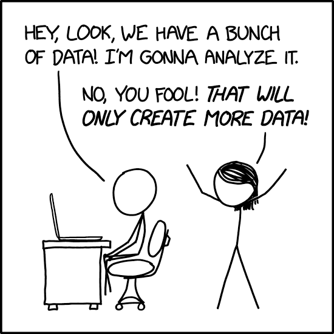
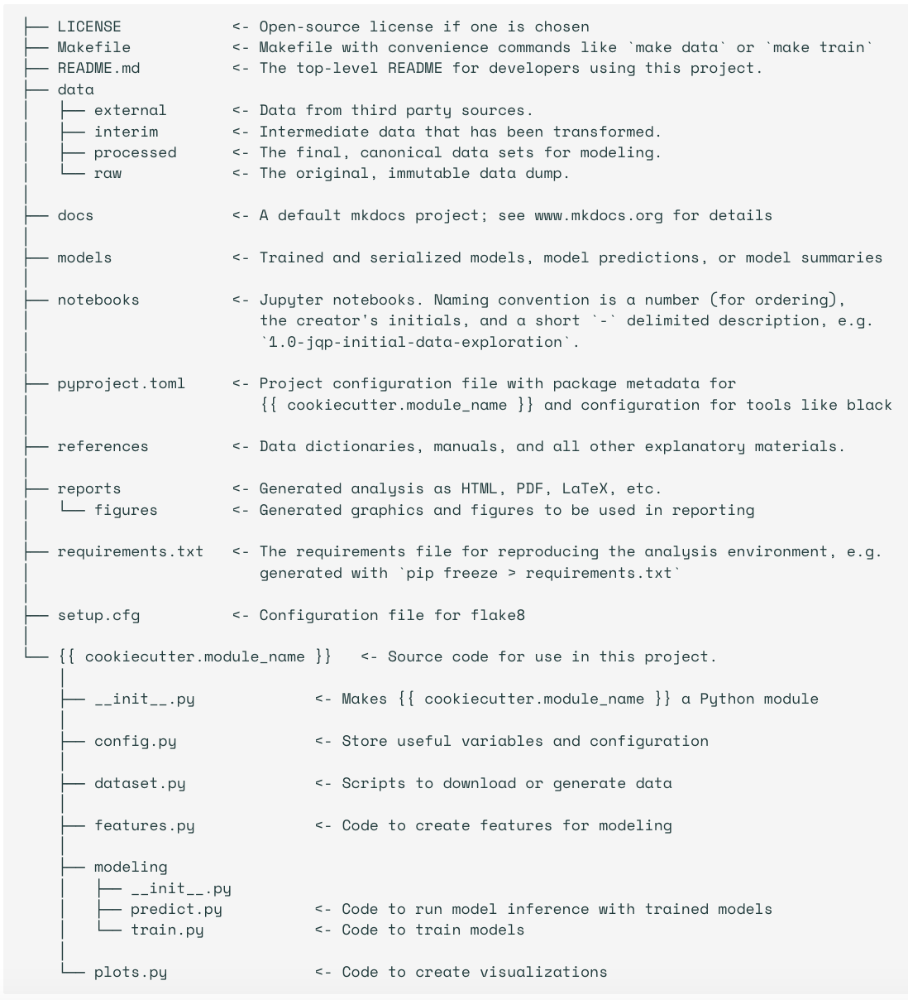
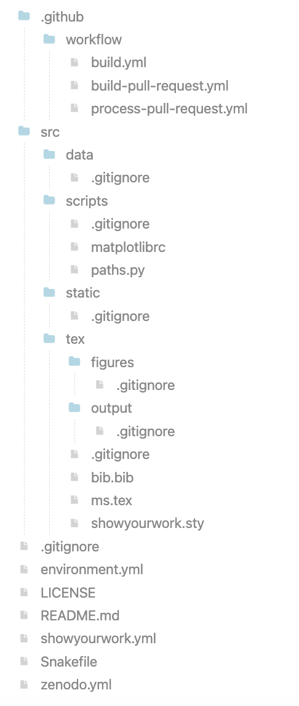

\# SharingIsCaring

## Definitions

**What is Data Management?**

Data management comprises all disciplines related to handling data as a valuable resource, it is the practice of managing an organization's data so it can be analyzed for decision making. (wikipedia) It includes areas such as data governance (who's responsible for what, who makes decisions, how is data being kept, by who, what are the ethincs surrounging the collection, storing and distribution of this data); data architecture (how is data structured); data modeling and design (how should the data be represented); database management; metadata, data quality, etc.

**What is Open Science?**

Open sience as a whole is a movement to make research as a whole (or specifically its artifacts: including data, software, publications, etc.) and the dissemination of scientific results, accessible to all levels of society. 

Open research is another term, considered to be more inclusive of the humanities. Also sometimes use: open scholarship

Generally, there are 6 pilars of open science:
- Open methods <--- some of this here
- Open source (software) <---- see other workshop
- Open data <-------------------
- Open access (journals)
- Open peer review (yes, this is what you think it is)
- Open educational access (retain, reuse, revise, remix, redistribute, e.g., CC licences)

In the context of OPEN DATA you will often hear about the FAIR principles: The FAIR principles (Findable, Accessible, Interoperable, and Reusable) are designed to make research data more discoverable, both by humans and machines, and to promote wider sharing and reuse of data. They can be applied to digital data and artefacts from any discipline. Working towards making research data more FAIR provides a range of benefits including:

- increasing the visibility and citations of your research
- improving the reproducibility and reliability of your research
- enabling  new innovative research approaches and tools 
- aligning with international standards and approaches

**FAIR** research data is easier to understand and share with collaborators or with the wider world.

**Findable:** To make research data findable, publish the data with as much as much metadata as possible + license + DOI + a sharing platform.

**Accessible:** make sure one can actually download the data without bariers. API?

**Interoperable:** To make research data interoperable, use community-accepted languages, formats and vocabularies in the data and metadata. 

**Reusable:** Data should come with a clear human- and machine-readable licence and provenance information on how it was collected or generated. It should also abide by discipline-specific data and metadata standards where possible, to ensure it retains important context.

(also see the FORCE 11 original publication: https://force11.org/info/the-fair-data-principles/)

## Motivation

Why talk about these topics?

- More funding agencies are requiring "Open Data" and "Data Management Plans". A lot of governments are intstituting rules on how research results, artifacts and data should be shared. Being aware of the best practices will help you be successful in fudning applications. NASA TOPS program: https://science.nasa.gov/open-science/tops/

- Some institutes now have policies around open data. Easier to comply if you know what this is. MPIA does not have a data policy. But we are now trying to clean up 3?5? PBs of data and this is challenging. 

- You are (or soon will be) running projects on your own and in ALL cases you need to think about how you should manage your own data and publish it. 

- MOST IMPORTANT: Makes your own work more efficient!

- If others are publishing their data too, it will be easier to reproduce and build on their results. Makes science progress faster.

## Problems:
- Scientists percieve "open data" and "data mangement" as more work
- Data and docs need to be perfect
- Policies help motivate but not enough
- Asking questions is good

- It's hard to be the early bird, people are afraid of being scooped, community adoption is better, but good data management practices pay off even if data is not published * 

## Types of data
- Data produced by a satelite, mission, observatory. Not directly your responsibility, there are (hopefully) some policies in place that govern the data rights. But products that you derive from that do do your science (see Type C) will be your data.

- Data produced by a collaboration. The collaboration should (hopefully) have some policies on data rights. 

- Your own data connected to the publications you write: your own responsibility. Probably most relevant for you now, but as you become grown up astronomers, you should also start thinking about 

## Best practices for data management
(from G. Wilson et al., Good enough practices in scientific computing. PLoS Comput Biol 13(6): e1005510. https://doi.org/10.1371/journal.pcbi.1005510)

- Save the raw data. This is the basis for your analysis, and as tempting it is to overwrite them with clean ones or junk them when you are done, DON'T. You WILL need them again. Make them read only. 
But in many cases it is impractical to do this especially for large binary files. Or document their provenance. Note: data in archives is not at rest.

- Ensure that raw data are backed up in more than one location. For astronomy, archives of observatories will sometimes (but not always) archive your data. But it is still useful to have a backed-up copy of the exact data you used (see above). Ensure your machine is backed by IT (your data is in a folder that is being backed up!!!), not just on an external drive. Move to MPCDF. Disk space is cheap, time is expensive, time machines don't exist.

- Create the data you wish to see in the world: make your data easy to understand, read and parse:
    - use standard formats! CSV, TSV, astropy FITS table, VO tables (not great to produce), HDF5, parquet, (VO parquet?), asdf
    - column names should be meaningful, column values documented in header or recoded, missing data should be replaced with NA or NaN
    - file names should store useful infomation and be good for pattern matching

- Create analysis-friendly data:  Tidy datasets are easy to manipulate, model and visualize, and have a specific structure: each variable is a column, each observation is a row, and each type of observational unit is a table (Wickham, H., 2014)

- Record ALL the steps used to process data.
- Anticipate the need to use multiple tables, and use a unique identifier for every record. Unique identifiers are key.

- Submit data to a reputable DOI-issuing repository so that others can access and cite it: Figshare, Dryad, and Zenodo
    - Make good metadata: metadata about what is in the data + metadata about the dataset as a whole. Example: google datasets.
    - Tell people how to cite your data
    - Add a license: to licence = no touchy. Creative Commons licenses for data and text, either CC-0 (the "No Rights Reserved" license) or CC-BY (the "Attribution" license, which permits sharing and reuse but requires people to give appropriate credit to the creators).

Taken in order, the recommendations above will produce intermediate data files with increasing levels of cleanliness and task specificity. An alternative approach to data management would be to fold all data-management tasks into a monolithic procedure for data analysis, so that intermediate data products are created "on the fly" and stored only in memory, not saved as distinct files.

While the latter approach may be appropriate for projects in which very little data cleaning or processing is needed, we recommend the explicit creation and retention of intermediate products. Saving intermediate files makes it easy to rerun parts of a data analysis pipeline, which in turn makes it less onerous to revisit and improve specific data-processing tasks. Breaking a lengthy workflow into pieces makes it easier to understand, share, describe, and modify. This is particularly true when working with large data sets, for which storage and transfer of the entire data set is not trivial or inexpensive.

## Publishing It

GET THYSELF A DIGITAL OBJECT IDENTIFIER! 

"The best option for releasing your data with long-term guarantee is to deposit them in whatever data archive is the “go to” place for your field. A proper, trustworthy archive will: (1) assign an identifier such as a “handle” (hdl) or “digital object identifier” (doi); (2) require that you provide adequate documentation and metadata; and (3) manage the “care and feeding” of your data by employing good curation practices."

Let's be honest: astro journals don't have teeth when it comes to requiring authors to publish data. MNRAS and A&A have a data availability policy but one of the possible answers is "The data underlying this article will be shared on reasonable request to the corresponding author." Which is equivalent to "go away".

MPG provided resources: https://www.mpdl.mpg.de/en/services/service-catalog.html?filter=research-services

MAST/IPAC and others can mind DOIs for datasets.

You can also give your final data back to its parent archive, MAST for example will take data and store it for you "in perpetuity".

Other options:

A: General Data Repositories
Dataverse (http://thedata.org): A repository for research data that takes care of long-term preservation and good archival practices, while researchers can share, keep control of, and get recognition for their data.

FigShare (http://figshare.com): A repository where users can make all of their research outputs available in a citable, shareable, and discoverable manner.

Zenodo (http://zenodo.org): A repository service that enables researchers, scientists, projects, and institutions to share and showcase multidisciplinary research results (data and publications) that are not part of existing institutional or subject-based repositories.

Dryad (http://datadryad.org): A repository that aims to make data archiving as simple and as rewarding as possible through a suite of services not necessarily provided by publishers or institutional websites.

B: Directories of Research Data Repositories
DataBib (http://databib.org): Databib is a tool for helping people identify and locate online repositories of research data. Users and bibliographers create and curate records that describe data repositories that users can search.

Re3data.org (http://www.re3data.org): Re3data is a global registry of research data repositories from different academic disciplines for researchers, funding bodies, publishers, and scholarly institutions.

Open Access Directory (http://oad. simmons.edu/oadwiki/Data_repositories): A list of repositories and databases for open data.

Force 11 Catalog (http://www.force11.org/catalog): A dynamic inventory of web-based scholarly resources, a collection of alternative publication systems, databases, organizations and groups, software, services, standards, formats, and training tools.

## Reproductions Packages

One way to make sure you have a good organization of your project is to use a template for organization. A template that helps you organize your data and scripts for a paper that helps a student reproduce your work. Depending on the project this may include:
- Links to raw data
- Scripts that derive products (reduction)
- The reduced/derivative products
- Analysis scrips
- Results tables
- Scripts to create each figure
- README that describes it all:
    - software requirements
    - data prerequisites

Example Structure:
- data/
- figures/
- notebooks/
- README.md

Here is an example:
https://github.com/jdeplaa/open-data-template

Another example: cookiecutter
https://cookiecutter-data-science.drivendata.org/

Show your work: https://github.com/showyourwork/showyourwork

Notice all the .gitignores!!! The data should not go in the repo!!!

## One step further: Open Workflows
(Based on Goodman et al., 2014, Ten Simple Rules for the Care and Feeding of Scientific Data)

### What is reasonable reuse?

It is practically impossible to document every singe decision that goes into making a dataset. Some choices will seem arbitrary, some will have to be arbitraty, most will not be the bestest choices for the people who want to reuse your data. So think of what level of reproducibiluty you want your users to have? What is a reasonable level of reproducibility your users may hope for or expect? 
- If you want/need all your work to be fully **reproducible**, then every steps needs to be documented in code, including environemt, raw data, etc.
- Maybe your work just needs to be **inspectable**. Maybe code is enough.
- Or maybe just your data needs to be **usable**. Maybe just data in standard formats + docs is enough.

### Publish Workflow 

There are applicatins that are dedicated to managing sequences of reduction and analysis steps (Taverna, Kepler, Wings, etc.). These are not used in astro. 

Instead consider publishing your Jupyter notebooks. I think AAS will publish notebooks.

Publish your snakemake files.

And your SLURM scripts. 

### Publish your code.

Put your code on github, add a licence, archive on Zenodo, add DOI to GitHub. And add a CITATION.cff file. Just do it. Better published than tidy. 

Attend the workshop on software packaging.

Also JOSS (for significant scholarly effort). Joint publications with AAS. 

### Link your workflows and your data in your papers.

Papers are still the most findable artifacts in research. 

### Always state how you want to get credit!

How should people cite your code?
How should they cite your data?
Don't make them cite an (in prep.) paper. 
Use DOIs and published papers.

"make information about you (e.g., your name, institution), about the data and/or code (e.g., origin, version, associated files, and metadata), and about exactly how you would like to get credit, as clear as possible."

It is astounding how many repositories on the GitHub have no contact info for the author!

### Reward colleagues who share data and code

- GIVE THEM CREDIT in the way they ask you to.
- Credit is cheap, but a major currency in academia - give them credit. 
- Give them praise, in person and in the community (i.e., when you give talks)
- Mention this work in letters for promotions and recommendtions
- Promote the work of colleagues whose data have really helped your science: invite them for talks, nominate them for awards.
- Get familiar with the DORA recommendations (https://sfdora.org/read/) and promote them at your institution. 

### Be a booster for open science

- Foster these practices in your own groups. Allow students the time to learn new tools with the promise that they will be more efficient researchers later.
- Make sure students understand the effort that goes into developing open data and software and they also follow proper citation and attribution practices.
- Appreciate that doing all of this takes time and energy and be an advocate for your colleagues when they are up for performance appraisals, promotions, awards, that this effort is recognized.
- Get familiar with the DORA recommendations (https://sfdora.org/read/) and promote them at your institution. 

Progress will not happen by itself. The practices described here are increasingly incentivized by requirements from journals and funding agencies, but the time and skills required to actually do them are still not being valued.

At a local level, principal investigators (PIs) can have the most impact, requiring that the research their lab produces follow these recommendations. Even if a PI doesn't have a background in computation, they can require that students show and share their code in lab meetings and with lab mates, those data are available and accessible to all in the lab, and that computational methods sections are comprehensive. PIs can also value the time it takes to do these things effectively and provide opportunities for training.

Many funding agencies now require data-management plans, education, and outreach activities. Just having a plan does not mean you have a good plan or that you will actually execute it. Be a good community citizen by setting an example for what good open science looks like.  The true cost of implementing these plans includes training; it is unfair as well as counterproductive to insist that researchers do things without teaching them how. We believe it is now time for funders to invest in such training; we hope that our recommendations will help shape consensus on what "good enough" looks like and how to achieve it.

